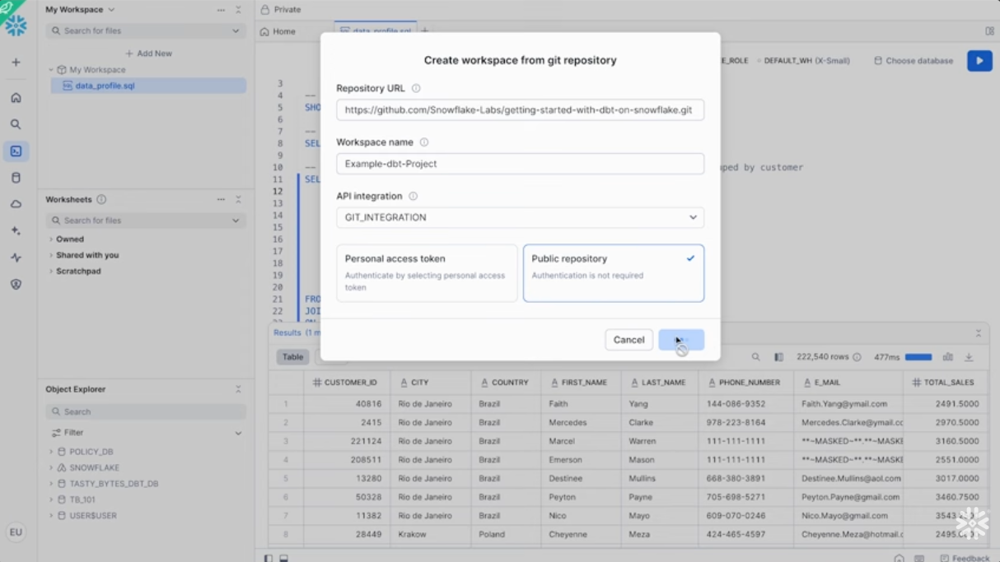

# Getting Started with dbt on Snowflake

## Overview

This repository contains an example dbt project to get you started with dbt on Snowflake adapted for the ITM327 BYU-Idaho Course.

## Following the dbt demo YouTube video

[Running dbt Projects On Snowflake](https://www.youtube.com/watch?v=w7C7OkmYPFs)

### When you get to the Git Repo Setup
   - Use this repo's url instead of the one in the video
   - Select `Public Repository` (no PAT needed for this demo)
   - Otherwise follow the video step by step (the dropdown he picks in the window is now incorporated in the blue button dropdown)
      1. dbt `deps`
      2. `compile`
      3. `run`
         Note: run can take up to 10 min so be patient
      4. View compiled SQL
      5. Run compiled SQL
      6. Run `test`
      7. Deploy dbt project
         Note1: When deploying, select `TB_101.DEV` as the target schema (not RAW — RAW is read-only source data)
         Note2: Use `dbt_project_lastn_fi` naming convention
      8. Understand how to orchestrate the project

## Things to Understand from this Demo

### dbt Project Structure
   - What does each folder do? (`models/`, `tests/`, `macros/`, `seeds/`, `snapshots/`)
   - How does `dbt_project.yml` configure materialization types (view vs table)?
   - How does `profiles.yml` define the `dev` and `prod` targets — and why does that separation matter?

### The EtLT Pattern
   - Raw source data lives in `TB_101.RAW` — dbt never writes here
   - dbt performs the **T** (Transform) by reading from `RAW` and writing to `DEV` or `PROD`
   - Staging models (`models/staging/`) are thin views that clean and rename raw data
   - Mart models (`models/marts/`) contain business logic and are materialized as tables

### Jinja Templating
   - What is `{{ ref('model_name') }}`? How does it build the dependency graph?
   - What is `{{ source('tb_101', 'TABLE_NAME') }}`? How does it connect to raw data?
   - Look at `tests/generic/test_is_positive_amount.sql` — this is a custom test written as a Jinja macro

### Data Testing
   - Built-in tests: `not_null`, `unique`, `relationships` — declared in YAML, compiled to SQL by dbt
   - Custom generic test: `is_positive_amount` — returns failing rows if a value is ≤ 0
   - Tests run against source data in `RAW`, not the transformed models
   - A passing test returns 0 rows

### Python Models (Snowpark)
   - `models/marts/sales_metrics_by_location.py` is a dbt Python model
   - It uses Snowpark DataFrames instead of SQL — useful for complex transformations
   - Note: Python files cannot be run directly in Snowflake Workspaces — they are executed by dbt via Snowpark

### Deployment & Orchestration
   - `dev` target → `TB_101.DEV` schema (for development and this demo)
   - `prod` target → `TB_101.PROD` schema (for scheduled production runs)
   - Snowflake Tasks can schedule dbt project runs for orchestration

### Dev/Prod and CI/CD (Beyond the Demo)
The demo shows you running dbt manually in a `dev` environment, but in a real-world team this workflow is automated through CI/CD (Continuous Integration / Continuous Deployment):

   - **Dev** is where individual developers write and test changes — each person may have their own schema (e.g. `TB_101.DEV_JOHN`) so they don't overwrite each other's work. Runs here are triggered manually or on-demand, not on a schedule
   - **Pull Requests** — when a developer is done, they open a PR in GitHub. This triggers automated CI checks: dbt compiles, runs tests, and validates the changes before any human reviews them
   - **Merge to main** — once the PR is approved and CI passes, the code merges to the main branch, which triggers a CD pipeline that runs `dbt run --target prod`, promoting the changes to `TB_101.PROD`
   - **Prod** is the stable, trusted schema that downstream dashboards and reports read from. Here orchestration is managed by scheduled Snowflake Tasks that run `dbt run` on a defined cadence (hourly, daily, etc.) — not manually

**How the data mirrors across layers:**
The same model names appear in all three schemas, but at different stages of transformation:
   - `TB_101.RAW` — raw source tables loaded directly from the data pipeline (e.g. `ORDER_HEADER`, `TRUCK`). dbt reads from here but never writes here
   - `TB_101.DEV` — dbt-built views and tables reflecting the current developer's work-in-progress transformations (staging views + mart tables)
   - `TB_101.PROD` — identical structure to DEV but contains production-quality, tested, and approved transformations that business users and dashboards rely on

This layered pattern ensures broken SQL or failed tests never reach production, and that dev work never disrupts live reporting.

## Resources:
https://www.snowflake.com/en/developers/guides/getting-started-with-dbt-projects-on-snowflake/
